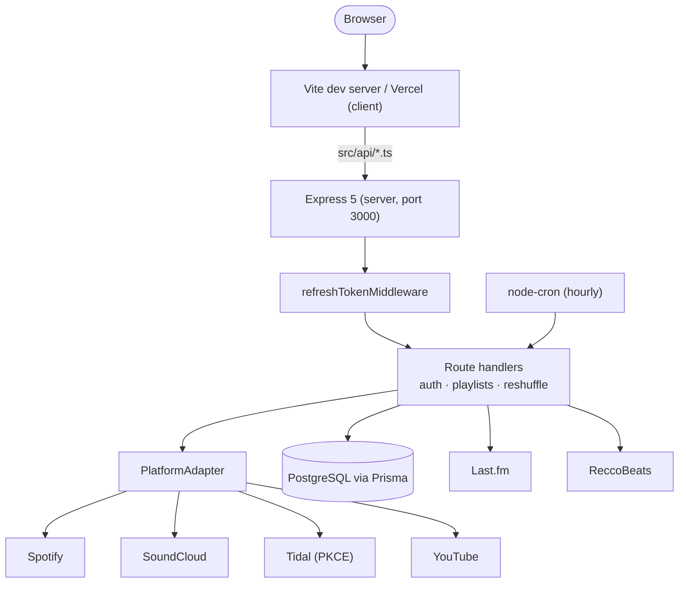
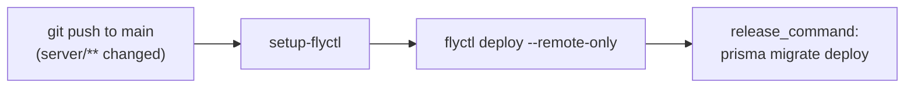

# 🎧 TuneCraft

[](client/package.json)
[](client/package.json)
[](server/package.json)
[](server/package.json)
[](server/package.json)
[](client/package.json)
[](server/tests)
[](.github/workflows/deploy.yml)
[](client/vercel.json)

Smarter playlist management: analyze, shuffle, organize, and automate a music library across
Spotify, SoundCloud, Tidal, and YouTube.

A track carries no audio features or genre tags on its own — TuneCraft enriches every track it
touches with tempo, energy, and genre data, then layers composable shuffle, split, merge, and
scheduled auto-reshuffle on top. The full feature set, current progress, and technical notes
live in [`TUNECRAFT_ROADMAP.md`](TUNECRAFT_ROADMAP.md); day-to-day conventions are in
[`CLAUDE.md`](CLAUDE.md).

**Live:** [tune-craft-seven.vercel.app](https://tune-craft-seven.vercel.app/)

## 📑 Table of Contents

- [🏗️ Architecture](#-architecture)
- [🎼 Track enrichment](#-track-enrichment)
- [💻 Local development](#-local-development)
- [🔑 Environment variables](#-environment-variables)
- [🔌 API surface](#-api-surface)
- [🧪 Testing](#-testing)
- [🔄 CI/CD pipeline](#-cicd-pipeline)
- [📁 Repo layout](#-repo-layout)
- [👤 Author](#-author)

## 🏗️ Architecture



- **Client** (`client/`) — React 19 + Vite + React Router. `src/api/*.ts` holds typed fetch
  wrappers; every request carries the internal DB `userId` from `localStorage`.
- **Express 5 server** (`server/src/index.ts`, port 3000) — mounts the route handlers behind
  `refreshTokenMiddleware` (`server/src/middleware/refreshToken.ts`), which runs before every
  playlist and reshuffle route, transparently refreshing an expired platform token and
  attaching the valid one to the request.
- **Route handlers** (`server/src/controllers/`, split by domain: `library`, `discover`,
  `tracks`, `operations`) — the layer that talks to Prisma, Last.fm, and ReccoBeats, and calls
  into the platform adapter for anything that reads or writes the user's actual playlists.
- **PlatformAdapter** (`server/src/lib/platform/`) — one interface, one implementation per
  streaming platform (`spotify.ts`, `soundcloud.ts`, `tidal.ts`, `youtube.ts`). Route handlers
  never call a platform API directly, so adding a platform means implementing the interface and
  registering it in `registry.ts` — no route changes.
- **PostgreSQL via Prisma** — `User`, `Playlist` (auto-reshuffle schedules), `TrackCache`
  (audio features, keyed by ISRC across platforms), and `ArtistCache` (genres, keyed by
  normalized artist name).
- **Last.fm and ReccoBeats** — genre tags and audio features respectively; see
  [Track enrichment](#-track-enrichment).
- **node-cron** (`server/src/lib/crons/reshuffle.ts`) — runs hourly, reshuffles every playlist
  whose schedule is due, and deletes orphaned schedules on a platform 404.

## 🎼 Track enrichment

A platform API returns track metadata but no audio analysis or genre data. On every tracks
request the server checks `TrackCache` and `ArtistCache` first — the `TrackCache` lookup queries
`spotifyId`, `soundcloudId`, `tidalId`, `youtubeId`, and `isrc` in one `OR` query, so a track
already cached from one platform is never re-fetched for another. Misses go to ReccoBeats
(batches of 40) for audio features and Last.fm for genre tags, then upsert by ISRC so the same
recording is never sent to ReccoBeats twice. Full pipeline detail, the cache write-policy table,
and the shuffle algorithm order are in [`CLAUDE.md`](CLAUDE.md#track-enrichment-pipeline).

## 💻 Local development

**Prerequisites:** Node.js (latest LTS), a PostgreSQL instance, and developer app credentials
for Spotify, SoundCloud, Tidal, and YouTube — see [Environment variables](#-environment-variables).

1. Install from the repo root:

   ```bash
   npm install --prefix server && npm install --prefix client
   ```

2. Create the server environment file:

   ```bash
   cp server/.env.example server/.env
   ```

   Fill in the OAuth client IDs/secrets, `DATABASE_URL`, and `HMAC_SECRET` — see
   [Environment variables](#-environment-variables).

3. Apply the database schema:

   ```bash
   cd server && npx prisma generate && npx prisma migrate dev
   ```

4. Start everything from the repo root:

   ```bash
   npm run dev
   ```

   This runs the server, the client, and `prisma studio` concurrently.

5. Open the app at `http://127.0.0.1:5173`. Health check: `http://127.0.0.1:3000/health`.

## 🔑 Environment variables

Read by the server from `server/.env`; the full annotated template is
[`server/.env.example`](server/.env.example).

| Variable | Required | Default | Purpose |
|---|---|---|---|
| `SERVER_URL` | yes | — | Backend base URL. OAuth redirect URIs for every platform are derived from it. |
| `FRONTEND_URL` | yes | — | Where the browser is redirected after OAuth login. |
| `PORT` | no | `3000` | Server listen port. |
| `SPOTIFY_CLIENT_ID` / `SPOTIFY_CLIENT_SECRET` | yes | — | Spotify OAuth app credentials. |
| `SOUNDCLOUD_CLIENT_ID` / `SOUNDCLOUD_CLIENT_SECRET` | yes | — | SoundCloud OAuth app credentials. |
| `TIDAL_CLIENT_ID` / `TIDAL_CLIENT_SECRET` | yes | — | Tidal PKCE OAuth app credentials. |
| `YOUTUBE_CLIENT_ID` / `YOUTUBE_CLIENT_SECRET` | yes | — | Google Cloud OAuth 2.0 credentials for the YouTube Data API v3. |
| `LASTFM_API_KEY` / `LASTFM_SECRET` | yes | — | Genre tag lookups. |
| `DATABASE_URL` | yes | — | Pooled Postgres connection, used at runtime. |
| `DIRECT_DATABASE_URL` | yes | — | Direct (non-pooled) connection, required by `prisma migrate dev`. |
| `RESEND_API_KEY` | yes | — | Sends Spotify access-request notification emails. |
| `ADMIN_EMAIL` | yes | — | Recipient for those notifications. |
| `HMAC_SECRET` | yes | — | Signs user session tokens (HMAC-SHA256). Rotating it logs out every user. |
| `FLY_API_TOKEN` | no (CI only) | — | GitHub Actions secret used to deploy the server to Fly.io. Not needed locally. |

## 🔌 API surface

```
GET    /auth/login?platform=SPOTIFY|TIDAL|SOUNDCLOUD|YOUTUBE   redirects to platform OAuth/PKCE
GET    /auth/spotify/callback
GET    /auth/tidal/callback
GET    /auth/soundcloud/callback
GET    /auth/youtube/callback                                  upserts user, redirects to frontend

GET    /playlists/:userId                                      owned + followed playlists
GET    /playlists/:userId/:playlistId/tracks                   enriched tracks
PUT    /playlists/:userId/:playlistId/save                     persist a new track order
POST   /playlists/:userId/:playlistId/shuffle                  shuffle and save
POST   /playlists/:userId/:playlistId/split                    create multiple playlists from groups
POST   /playlists/:userId/merge                                merge tracks from several playlists
POST   /playlists/:userId/copy                                 copy a playlist into the user's library
GET    /playlists/:userId/discover                              fetch + enrich any public playlist by URL

POST   /reshuffle/:userId/:playlistId/schedule                 create or update auto-reshuffle
DELETE /reshuffle/:userId/:playlistId/schedule
GET    /reshuffle/:userId/:playlistId/schedule

GET    /health
```

`:userId` is the internal DB `cuid`, not a platform ID — it comes from `localStorage` after
login. Route handlers live in `server/src/controllers/`, split by domain (`library`, `discover`,
`tracks`, `operations`); `routes/*.ts` files are pure route registration.

## 🧪 Testing

```bash
npm test --prefix server   # Vitest — controllers (tracks, discover) + pure functions (shuffle, ISRC lookup)
npm test --prefix client   # Vitest + Testing Library — hooks (tracks, actions, reshuffle) + UI screens
```

## 🔄 CI/CD Pipeline



[`.github/workflows/deploy.yml`](.github/workflows/deploy.yml) deploys only `server/` to Fly.io,
and only on a push to `main` that touches `server/**`. [`server/fly.toml`](server/fly.toml) sets
the app to `tunecraft-server` in `lhr`, with `min_machines_running = 0` — the machine stops when
idle and Fly's `release_command` runs pending Prisma migrations before every deploy. The client
is not covered by this workflow; it deploys separately via Vercel.

## 📁 Repo Layout

```
client/src/
  api/          typed fetch wrappers (playlists, tracks, reshuffle)
  components/   modals (Shuffle, Split, Merge, Copy, Duplicates), TrackRow, AppFooter, sidebar
  hooks/        usePlaylistTracks, usePlaylistActions, useReshuffleSchedule
  pages/        Login, Dashboard, PlaylistDetail, Contact, PrivacyPolicy, Callback
  utils/        shuffleAlgorithms, splitPlaylist, mergePlaylists, platform helpers
  __tests__/    Vitest suite — hooks + UI screens
server/src/
  controllers/  route handlers by domain: library, discover, tracks, operations
  routes/       auth.ts, playlists.ts, reshuffle.ts — registration only
  middleware/   refreshToken.ts
  lib/
    platform/   PlatformAdapter interface + Spotify/SoundCloud/Tidal/YouTube adapters, registry
    crons/      hourly auto-reshuffle job
    shuffleAlgorithms.ts
    playlistHelpers.ts   enqueueWrite (per-user write queue), calculateAverages
    requestWithRetry.ts  429 handling shared by every platform adapter
server/tests/   Vitest suite — controllers + pure functions
server/prisma/  schema and migrations
shared/         shuffleAlgorithms.ts — shared shuffle algorithm implementation
TUNECRAFT_ROADMAP.md   full feature roadmap, progress, technical notes
DESIGN.md               design system reference
```

## 👤 Author

**Yarin Solomon** — Full Stack Developer

- Email: [yarinso39@gmail.com](mailto:yarinso39@gmail.com)
- GitHub: [github.com/yarins0](https://github.com/yarins0)
- LinkedIn: [linkedin.com/in/yarin-solomon](https://www.linkedin.com/in/yarin-solomon/)
- Portfolio: [yarin-lab](https://yarin-lab.vercel.app/)
